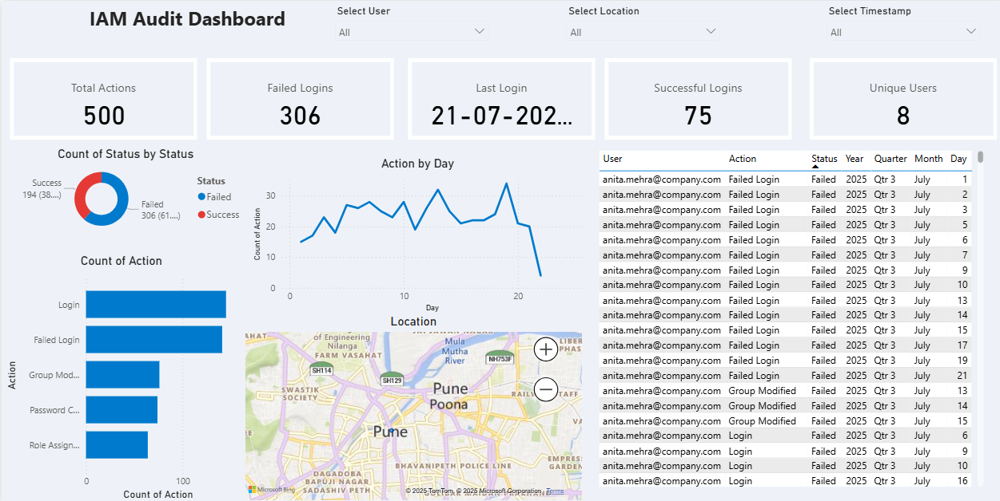

# 📊 IAM Audit Dashboard (Power BI)

This is a professional Power BI dashboard designed to analyze Identity and Access Management (IAM) activity using mock Microsoft Entra ID audit logs.

> 👩‍💻 Created by Yashaswini – Security & Data Analyst | IAM | Entra ID | Power BI

---

## 🔍 Dashboard Features

- ✅ Visualizes user login patterns and failures
- 🌐 Map-based location breakdown
- 🧠 DAX Measures:
  - Total Actions
  - Failed Logins
  - Unique Users
  - Last Login Time
- 📅 Time-based drill down (Year → Month → Day)
- 🎨 Custom color theme and conditional formatting

---

## 📸 Dashboard Preview

---

## 📁 Files in this Repo

| File | Description |
|------|-------------|
| `IAM_Audit_Log_Sample_Large.csv` | Sample dataset |
| `IAM_Audit_Dashboard.pbix` | Final dashboard file |
| `Yashaswini_IAM_PowerBI_Theme_MINIMAL_OK.json` | Custom Power BI theme |
| `README.md` | Project overview and setup instructions |

---

## 📫 Contact

- LinkedIn: [suryawanshiyashaswini](https://www.linkedin.com/in/suryawanshiyashaswini/)
- Email: suryawanshi.yashaswini@gmail.com
